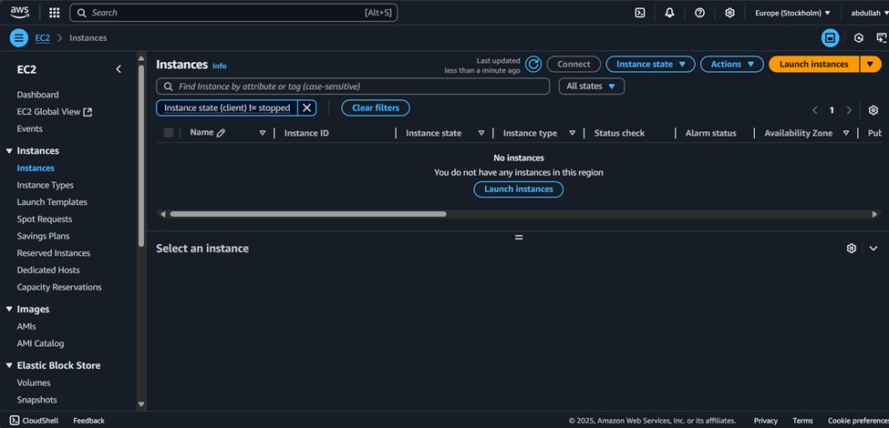
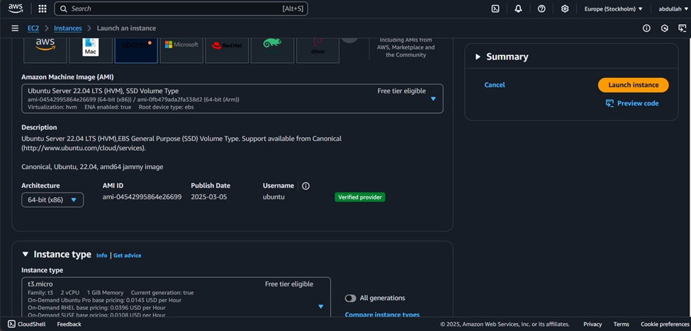
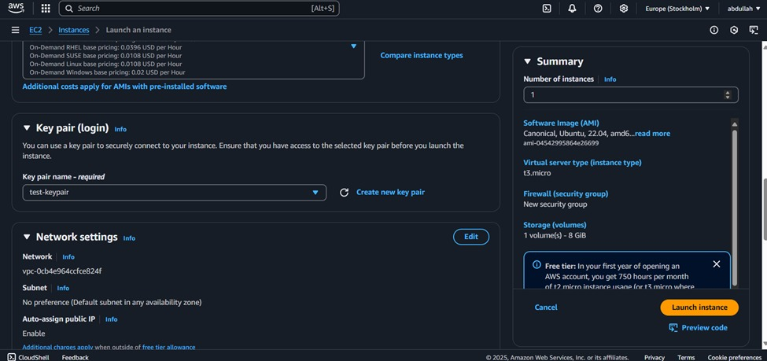
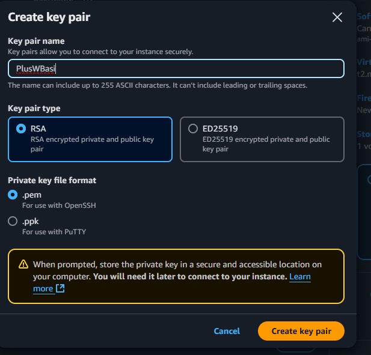
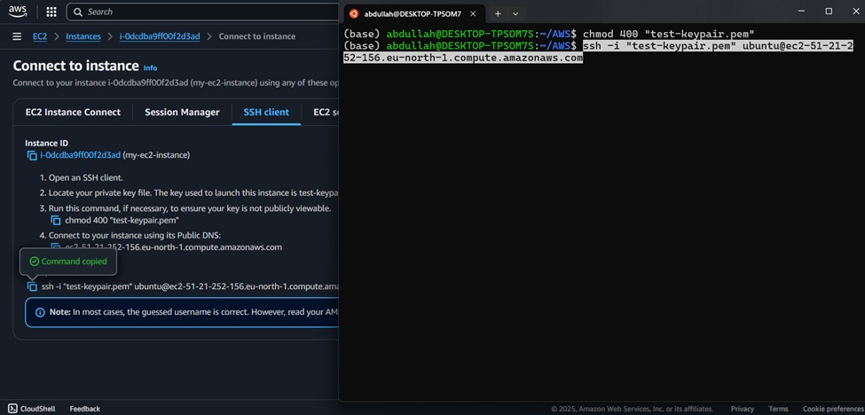
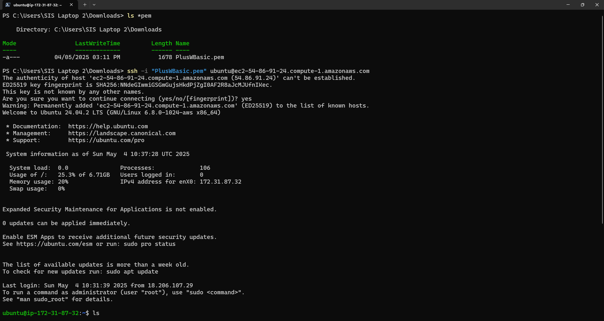
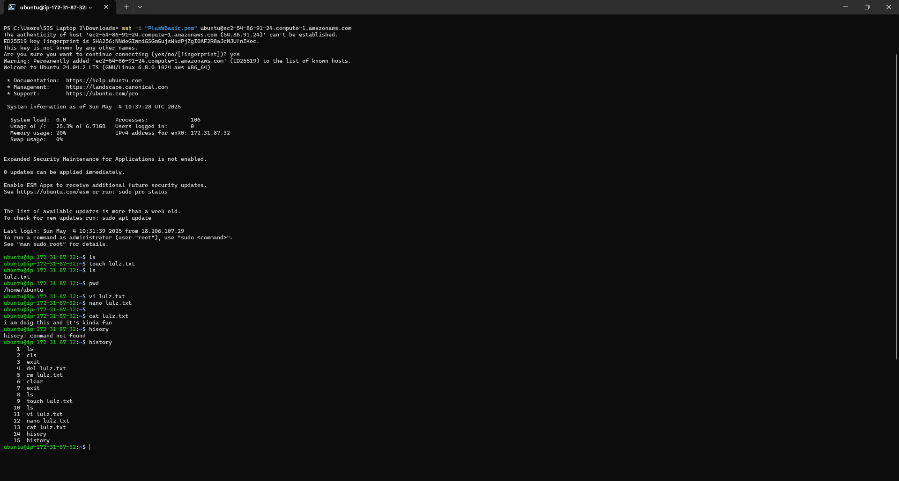

# 🚀 Class 13 - AWS EC2 Virtual Server Setup

  
  
  

**👨‍🏫 Instructors:** [Hafiz Muhammad Umair Munir](https://www.linkedin.com/in/hafiz-muhammad-umair-munir-b929b0173/), [Abdul Ahad](https://www.linkedin.com/in/ahad-pro-soft/), [Abdul Hanan Ashraf](https://www.linkedin.com/in/abdul-hanan-ashraf-156115157/)  
**🎓 Organized by:** [Plus W 株式会社](https://www.linkedin.com/company/plus-w) & [Pakistan Japan Centre](https://www.linkedin.com/company/pakistan-japan-centre)  
**🌐 Supported by:** [AOTS](https://www.linkedin.com/company/aotsjapan/) & [Overseas Employment Corporation (OEC)](https://oec.gov.pk/)  

---

## 🧠 What We Learned Last Week

- 🔁 Control & loop flow statements in Python  
- ➕ Linear algebra using NumPy  
- 🔍 Dataset inspection and understanding  
- 💡 Importance of requirement analysis  
- ✅ Practices for effective requirement gathering  
- 🤖 Overview of machine learning algorithms  
- 🛠️ Software Development Life Cycle (SDLC)  
- 🌊 Gitflow, Waterfall & Agile methodologies  
- 🔒 Introduction to Security Compliance  

---

## 📅 Class's Agenda

- ☁️ Intro to AWS & EC2  
- 🐧 Comparing Linux Distros (Ubuntu, Amazon Linux, CentOS, Rocky)  
- 🧾 Creating an AWS account + Free Tier explained  
- ⚙️ Step-by-step: Launching EC2 instance  
- 🔐 Creating & managing SSH key pairs  
- 💻 Connecting via terminal (SSH)  

---

## 🛠️ EC2 Setup - Quick Reference

### 🔸 1. Create AWS Account  
- [aws.amazon.com](https://aws.amazon.com)



### 🔸 2. Launch EC2 Instance  
- Choose AMI (e.g. Ubuntu 22.04 LTS)  
- Instance type: `t3.micro` (Free Tier)  
- Security group: allow port `22` (SSH)  
- Create key pair: download `.pem`




### 🔸 3. Connect via Terminal / Git Bash  
```bash
chmod 400 your-key.pem
ssh -i "your-key.pem" ubuntu@<Your-Public-IP>
```










### 🔸 3. Test out some commands


