# 🚀 Class 15 – Linux Networking, Compression & Filtering Commands

  
  


**👨‍🏫 Instructors:** [Hafiz Muhammad Umair Munir](https://www.linkedin.com/in/hafiz-muhammad-umair-munir-b929b0173/), [Abdul Ahad](https://www.linkedin.com/in/ahad-pro-soft/), [Abdul Hanan Ashraf](https://www.linkedin.com/in/abdul-hanan-ashraf-156115157/)  
**🎓 Organized by:** [Plus W 株式会社](https://www.linkedin.com/company/plus-w) & [Pakistan Japan Centre](https://www.linkedin.com/company/pakistan-japan-centre)  
**🌐 Supported by:** [AOTS](https://www.linkedin.com/company/aotsjapan/) & [Overseas Employment Corporation (OEC)](https://oec.gov.pk/) 

---

## 🧠 Topics Covered

- 🌐 Understanding the Linux file system hierarchy and user roles
- 🛠️ Step-by-step guide on creating users and groups
- 🔒 Changing file permissions and ownership
- 🔍 Basic and system-level Linux commands
- 📊 Practical applications of networking and compression commands
- 📝 Quiz and Q&A session

---

## 📝 Class Assignment
In this assignment, we act as junior system administrators using real-world Linux commands to manage user permissions, diagnose networks, compress data, and extract logs using grep and awk. This assignment simulates production tasks to build confidence with CLI tools.

---
### 📁 Part 1: User & Group Permissions

#### 🔧 Task 1.1 – Create Users & Groups
```bash
sudo groupadd network_team
sudo useradd -m -G network_team alice
sudo useradd -m -G network_team bob
```

- groupadd creates a new group called network_team.
- useradd -m -G creates users alice and bob with home directories and adds them to the group.

📌 _Output:_

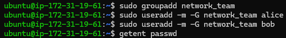

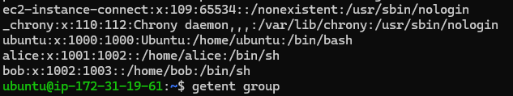

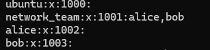

#### 📂 Task 1.2 – Set Directory Permissions
```bash
sudo mkdir /opt/network_data
sudo chown root:network_team /opt/network_data
sudo chmod 770 /opt/network_data
```

- mkdir creates a shared directory for the team.
- chown sets the group ownership to network_team.
- chmod 770 gives full access to the owner and group only.

📌 _Output:_

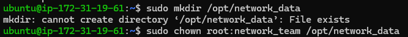


```bash
ls -ld /opt/network_data
```

- ls -ld displays the directory's permissions and metadata.

📌 _Output:_

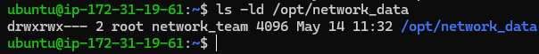

---
### 🌐 Part 2: Network Tools & Real-Time Checks
---


#### 📡 Task 2.1 – Check Connectivity
```bash
ping -c 4 google.com
traceroute google.com
mtr --report google.com
```

- ping sends ICMP packets to test reachability.
- traceroute shows the route packets take to the destination.
- mtr combines ping and traceroute to report network performance.

📌 _Output:_

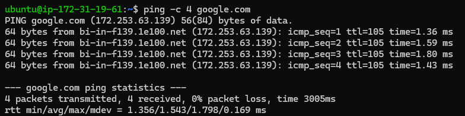

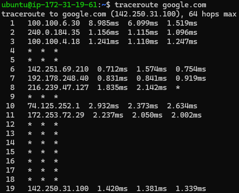

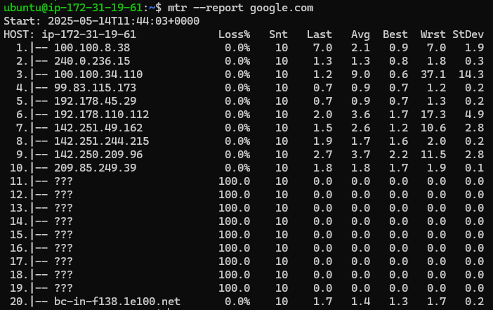

#### 🔍 Task 2.2 – Open Ports & Listening Services
```bash
sudo netstat -tuln
sudo ss -tulwn
```

- netstat and ss display open and listening ports along with their protocols.

📌 _Output:_

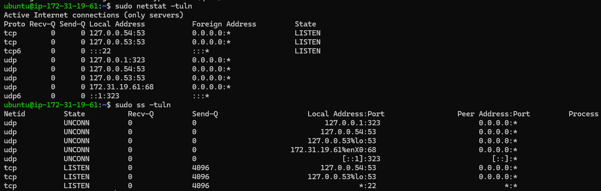

#### 🔌 Task 2.3 – Test Remote Port Connectivity
```bash
telnet google.com 443
nc -zv google.com 443
```

- telnet and nc test if port 443 is open and accepting connections.

📌 _Output:_

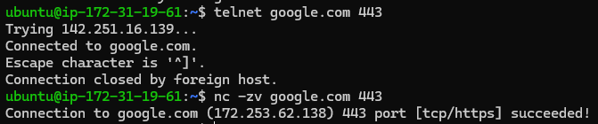

#### 🖧 Task 2.4 – Network Interfaces
```bash
ifconfig
ip addr
```

- ifconfig and ip addr display details about network interfaces and IP addresses.

📌 _Output:_

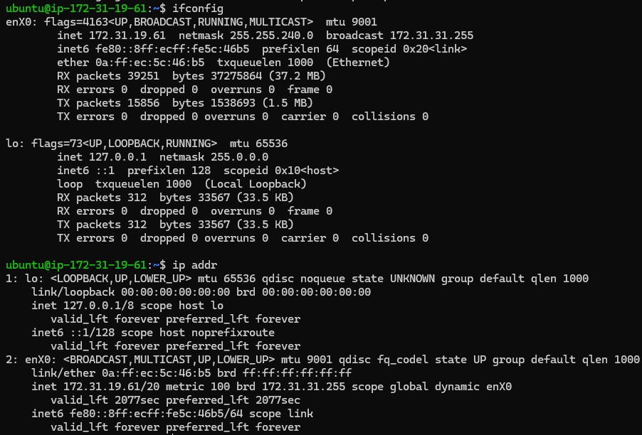

#### 🌍 Task 2.5 – DNS Lookup
```bash
nslookup google.com
dig google.com
```
- nslookup and dig perform DNS queries to resolve domain names to IPs.

📌 _Output:_

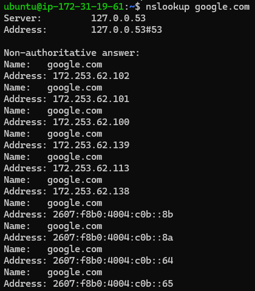

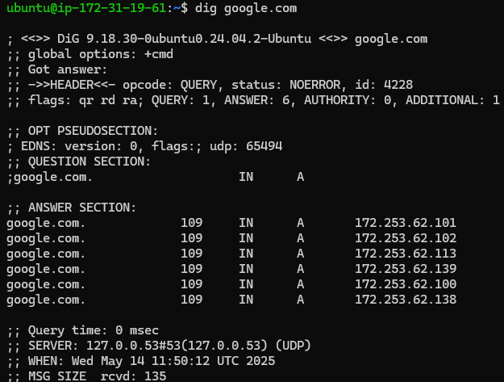

#### 📥 Task 2.6 – Download Test File
```bash
wget https://example.com/testfile.txt
curl -O https://example.com/testfile.txt
```

- wget and curl download a file from a remote server using HTTP.

📌 _Output:_

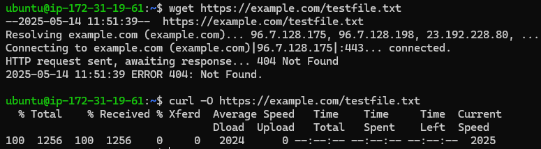

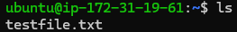

#### 📊 Task 2.7 – Monitor Bandwidth in Real-Time
```bash
sudo iftop -i eth0
sudo nload eth0
```

- iftop and nload monitor real-time network traffic usage on the selected interface.

📌 _Output:_

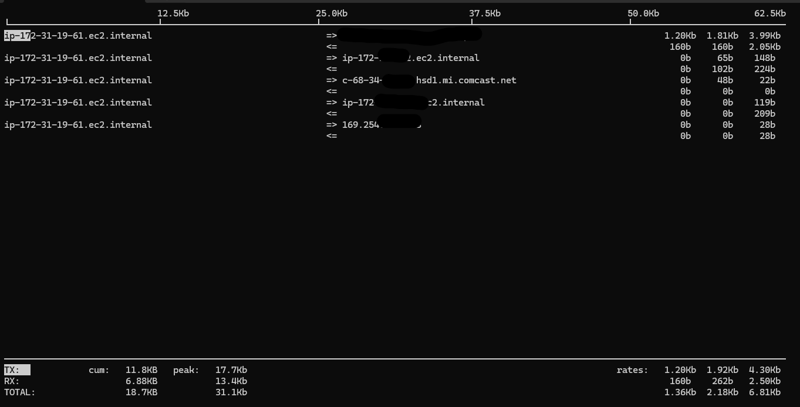

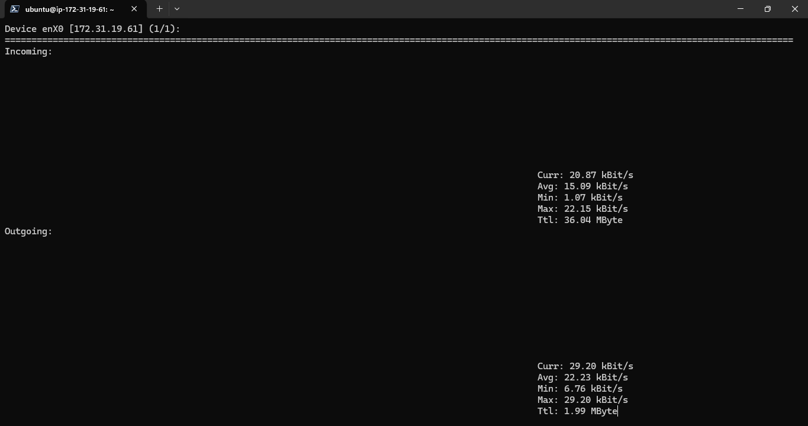

---
### 🗜️ Part 3: Compression & Decompression
---
#### 📦 Task 3.1 – Archive Directory
```bash
tar cvf network_data.tar /opt/network_data
```

- tar creates an archive file from the specified directory.

📌 _Output:_

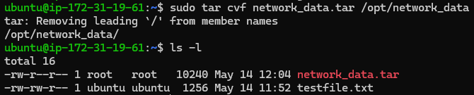

#### 🧩 Task 3.2 – Compress with gzip
```bash
gzip network_data.tar
```

- gzip compresses the .tar archive to reduce its size.

📌 _Output:_

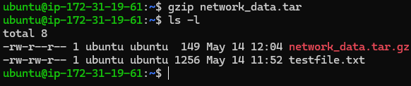

#### 📂 Task 3.3 – Decompress with gunzip
```bash
gunzip network_data.tar.gz
```

- gunzip decompresses the .gz file to restore the original archive.

📌 _Output:_

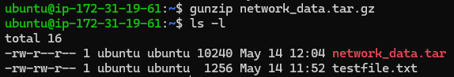

#### 🧷 Task 3.4 – Use bzip2 Compression
```bash
bzip2 network_data.tar
bunzip2 network_data.tar.bz2
```

- bzip2 compresses the archive using a different algorithm.
- bunzip2 decompresses the .bz2 file to retrieve the archive.

📌 _Output:_

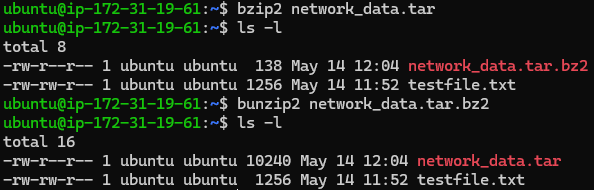

---
### 📄 Part 4: Text Processing with grep & awk
---
#### 🔍 Task 4.1 – Search for “error”
```bash
grep "error" /var/log/syslog
```

- grep searches for lines containing the word “error” in the system log file.

📌 _Output:_

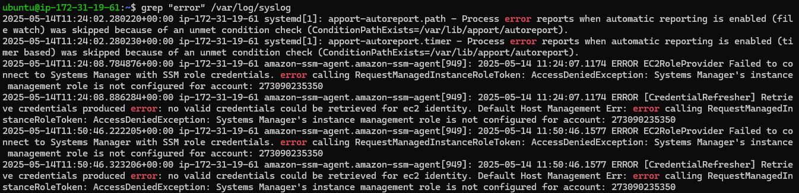

#### 🔢 Task 4.2 – Count Number of Errors
```bash
grep -c "error" /var/log/syslog
```

- -c tells grep to count how many lines match the search.

📌 _Output:_

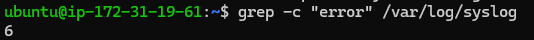

#### 📅 Task 4.3 – Extract Specific Fields
```bash
grep "error" /var/log/syslog | awk '{print $1, $2, $3, $5}'
```

- awk extracts the timestamp and source column from matching log entries.

📌 _Output:_

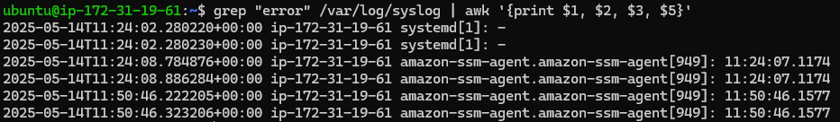

#### 📊 Task 4.4 – Filter & Summarize Errors
```bash
grep "error" /var/log/syslog | awk '{print $5}' | sort | uniq -c | sort -nr
```

- awk, sort, and uniq work together to count and sort unique error sources in descending order.

📌 _Output:_

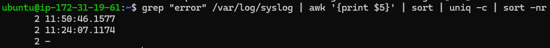
