# 🐚 Class 16 - Introduction to Bash Scripting Language & GitHub for AI Engineers

  
  


**👨‍🏫 Instructors:** [Hafiz Muhammad Umair Munir](https://www.linkedin.com/in/hafiz-muhammad-umair-munir-b929b0173/), [Abdul Ahad](https://www.linkedin.com/in/ahad-pro-soft/), [Abdul Hanan Ashraf](https://www.linkedin.com/in/abdul-hanan-ashraf-156115157/)  
**🎓 Organized by:** [Plus W 株式会社](https://www.linkedin.com/company/plus-w) & [Pakistan Japan Centre](https://www.linkedin.com/company/pakistan-japan-centre)  
**🌐 Supported by:** [AOTS](https://www.linkedin.com/company/aotsjapan/) & [Overseas Employment Corporation (OEC)](https://oec.gov.pk/)

---

## 🧠 Topics Covered

- 🐧 Introduction to Shell, Terminal, and Bash
- ✍️ Writing and executing bash scripts
- 🔤 Working with variables and user input
- 🔁 Conditional logic and loops in bash
- ⚙️ Bash functions and error handling
- 📁 Creating practical automation scripts
- 💡 Quiz (20 MCQs) and Q&A session

---

## 💡 Why Use Bash Scripting?

- ✅ Automate repetitive tasks  
- 🧪 Configure and manage servers  
- 🕐 Schedule tasks via cron  
- ⚙️ Lightweight automation in DevOps  

---

## 📁 Class Summary

### 📌 Part 1: What is Bash?

- Bash stands for **Bourne Again SHell**, a widely used Unix shell.
- It acts as a command-line interpreter to interact with the operating system.
- Students explored differences between **shell**, **terminal**, and **console**.

---

### 📌 Part 2: Writing Basic Bash Scripts

**Simple Script:**
```bash
#!/bin/bash
echo "This is kinda my first script"
```

📌 _Output:_

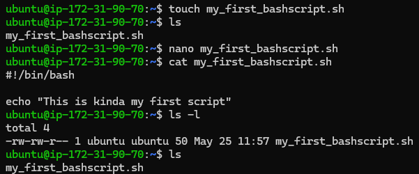

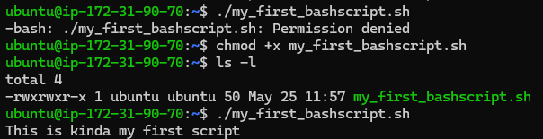

---

### 📌 Part 3: Using Variables and User Input

**Example:**
```bash
#!/bin/bash


#name=random
#age=999

<< Random
read -p "What is your name?" name
read -p "What is your age?" age

echo "My name is: $name"
echo "Also btw my age is: $age"
Random

echo "The script's name is: $0"
echo "My name is: $1"
echo "My age is: $2"
echo "The number of commands in this script are: $#"
echo "The commands are: $@"
```

📌 _Output:_

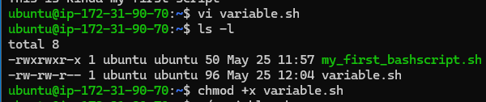

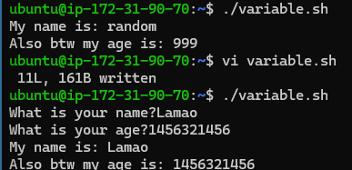

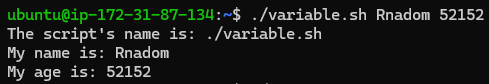

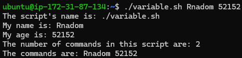

---

### 📌 Part 4: Conditional Statements and Loops

**Conditionals:**
```bash
#!/bin/bash

read -p "What's your age: " age

if [ $age -ge 18 ];then
        echo "You are an adult. You can ride the roller coaster"
elif [ $age -ge 13 ];then
        echo "You are a teenager. You can also ride the roller coaster"
else
        echo "You are underage. You cannot ride the roller coaster"
fi
```

📌 _Output:_

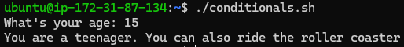

**Loops:**
```bash
#!/bin/bash

<< ForLoop
for i in 1 23 35 48 51; do
        echo "Num$i"
done

for i in {1..5}; do
        echo "Num$i"
done
ForLoop


<< WhileLoop
count=1
while [ $count -le 5 ]; do
        echo "$count"
        ((count++))
done
WhileLoop


x=1
until [ $x -gt 5 ]; do
        echo "I will kick you $x time(s)"
        ((x++))
done
```

📌 _Output:_

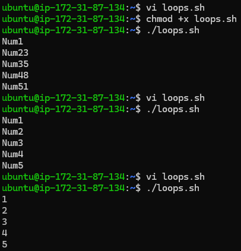

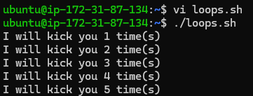


**Case:**
```bash
#!/bin/bash

read -p "Enter a letter: " letter
case $letter in
        a|A) echo "Ant";;
        b|B) echo "Bat";;
        c|C) echo "Cat";;
        *) echo "Unknown";;
esac
```

📌 _Output:_

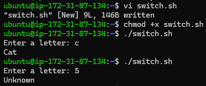

---

### 📌 Part 5: Bash Functions & Script Structure

**Function Declaration:**
```bash
#!/bin/bash

say_Salam()
{
        echo "Salam, $1!"
}
say_Salam $1
#"Jamal"
```

📌 _Output:_

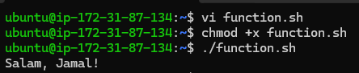

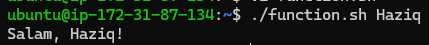

---

### 📌 Part 6: Error Handling & Logic Operators

**Example:**
```bash
#!/bin/bash

DIR="RnaodmName"

if [ -d "$DIR" ]; then
        echo "Directory $DIR already exists"
else mkdir $DIR
        echo "Directory $DIR created successfully"
fi
```

📌 _Output:_

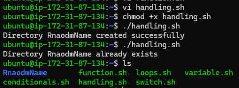

---

## 🧪 Practical Assignments

### 🧮 Assignment 1: Arithmetic Function (`sum.sh`)
```bash
#!/bin/bash

add()
{
        echo "The sum of $a and $b is: $(($a + $b))"
}
read -p "Enter a number to add: " a
read -p "Enter another number to add: " b

add $a $b
```

📌 _Output:_

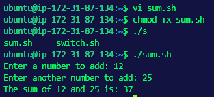

---

### 👤 Assignment 2: User Authentication Script (`login.sh`)
```bash
#!/bin/bash

read -p "Enter username: " username

if [ $username = admin ]; then
        echo "Welcome admin"
else echo "You do not have authorization"
fi
```

📌 _Output:_

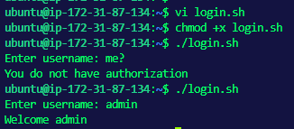

---

## 📚 References

- [GNU Bash Manual](https://www.gnu.org/software/bash/manual/)
- [Shell Scripting Tutorial](https://www.shellscript.sh/)
- [GitHub Docs](https://docs.github.com/)
