# 🐳 Class 17 - Introduction to Docker & Docker Compose for AI Engineers

  
  


**👨‍🏫 Instructors:** [Hafiz Muhammad Umair Munir](https://www.linkedin.com/in/hafiz-muhammad-umair-munir-b929b0173/), [Abdul Ahad](https://www.linkedin.com/in/ahad-pro-soft/), [Abdul Hanan Ashraf](https://www.linkedin.com/in/abdul-hanan-ashraf-156115157/)  
**🎓 Organized by:** [Plus W 株式会社](https://www.linkedin.com/company/plus-w) & [Pakistan Japan Centre](https://www.linkedin.com/company/pakistan-japan-centre)  
**🌐 Supported by:** [AOTS](https://www.linkedin.com/company/aotsjapan/) & [Overseas Employment Corporation (OEC)](https://oec.gov.pk/)

---

## 🧠 Topics Covered

- 🐳 Introduction to Docker and Docker Compose
- 🆚 Containers vs Virtual Machines
- 🛠️ Installing Docker on Linux
- 🧱 Building Docker images and running containers
- 📦 Writing Dockerfiles and docker-compose.yml
- 💬 Quiz and Q&A Session

---

## 📘 Recap of Last Week

- 🔁 Control and loop flow statements in Bash
- 📐 Linear Algebra using NumPy
- 📋 Requirement Analysis in Software Development
- 🤖 Machine Learning Algorithms
- 🔄 Software Development Life Cycle
- 🔐 Importance of Security Compliance
- 🖥️ Basic Linux Networking Commands
- 📜 Bash Scripting Essentials

---

## 📦 Docker Overview

### 📌 What is Docker?

Docker is an open-source platform that allows developers to package, ship, and run applications in containers.  
- Contains everything an app needs: code, runtime, system tools  
- Ensures consistency across dev and prod environments

---

### 📌 What is Containerization?

Containerization is a method to bundle applications with their dependencies.  
- Shares host OS kernel  
- Starts quickly and uses fewer resources than VMs  
- Ideal for microservices deployment

---

### 📌 Why Docker?

- 🚫 Eliminates "it works on my machine"
- 🔁 Enables repeatable deployments
- 🧪 Useful in CI/CD and testing environments
- ☁️ Perfect for cloud-native development

---

### 📌 Docker Architecture

- **Docker Engine:** Core engine to run containers  
- **CLI & Daemon:** Interface and management tool  
- **Docker Hub:** Public repository  
- **Dockerfile:** Instructions to build custom containers

---

### 📌 Key Terminology

- **Image:** Template for container  
- **Container:** Instance of image  
- **Volume:** Persistent data storage  
- **Network:** Communication between containers  
- **Dockerfile:** Blueprint to create image

---

## 🔧 Installing Docker (Linux)

**Requirements:** Linux OS, internet, sudo access

**Steps:**
```bash
sudo apt update
sudo apt install docker.io
sudo systemctl enable docker
sudo systemctl start docker
```

📌 _Output:_

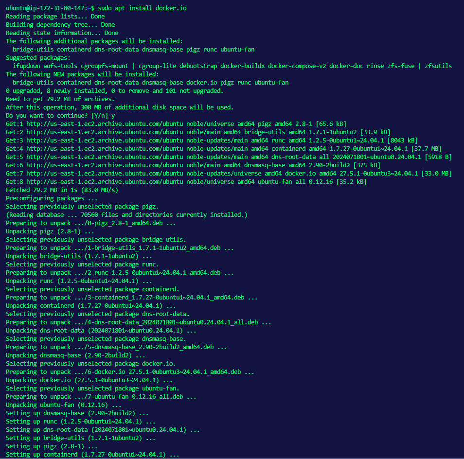

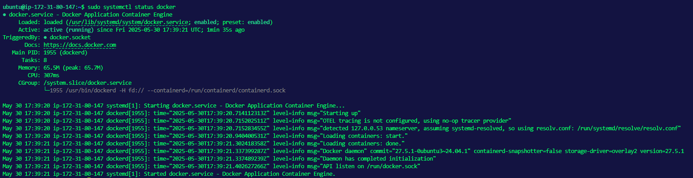

**Test Installation:**
```bash
docker --version
docker pull hello-world
docker images
docker run hello-world
```

📌 _Output:_

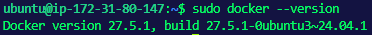

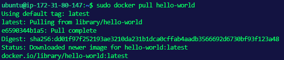

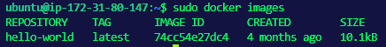

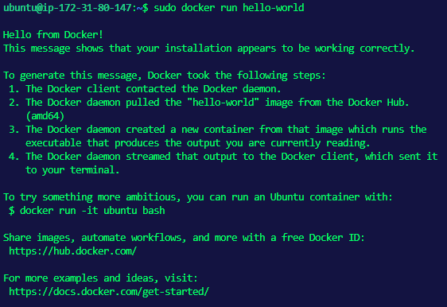

**Running Nginx:**
```bash
docker pull nginx
docker run -p 8080:80 nginx
```

📌 _Output:_

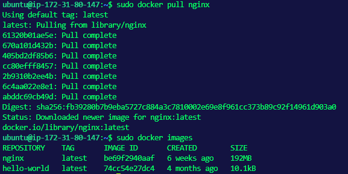

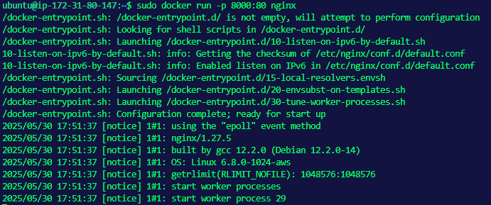

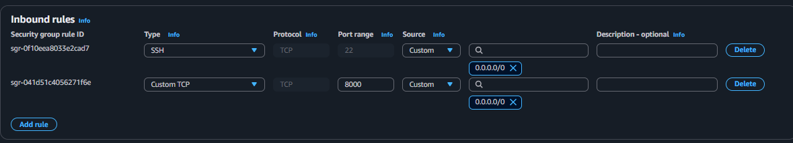

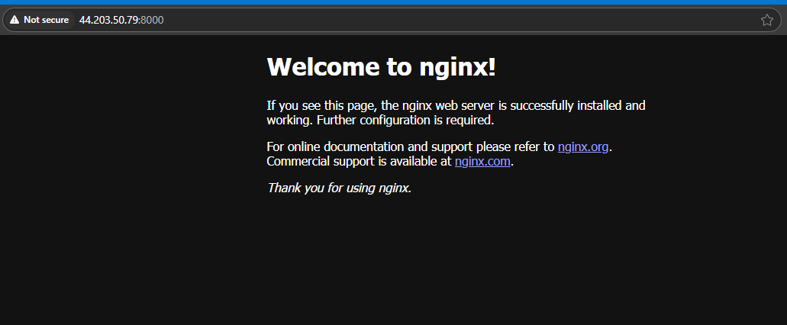

---

## 📂 What is a Dockerfile?

A text file containing instructions to build a Docker image.

### 🛠 Flask App Example

**app.py:**
```Python
from flask import Flask
app = Flask(__name__)
@app.route('/')
def home():
    return "Salam from Flask in Docker!"
if __name__ == '__main__':
    app.run(host='0.0.0.0', port=8000)
```

**requirements.txt:**
```txt
flask
```

**Dockerfile:**
```dockerfile
FROM python:3.11-slim
WORKDIR /app
COPY . .
RUN pip install --no-cache-dir -r requirements.txt
EXPOSE 8000
CMD ["python", "app.py"]
```

**Build and Run:**
```bash
docker build . -t disisname
docker run -d -p 8000:8000 disisname
docker ps -a
```

📌 _Output:_

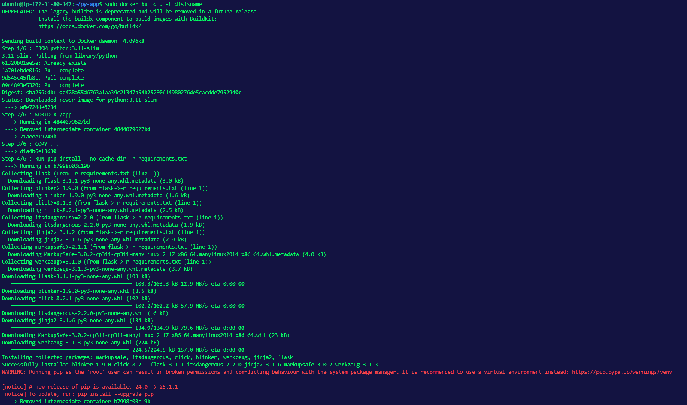

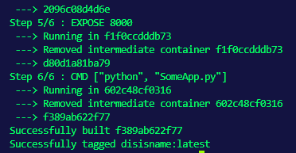

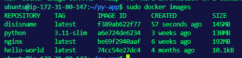

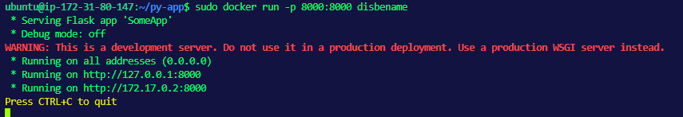

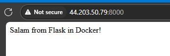

---

### 🛠 Node App Example

**index.js:**
```javascript
const express = require('express');
const app = express();
app.get('/', (req, res) => {
  res.send('Salam from Node.js Express!');
});
app.listen(3000, () => {
  console.log('Node app listening on port 3000');
});
```

**package.json:**
```json
{
  "name": "node-app",
  "version": "1.0.0",
  "main": "index.js",
  "scripts": {
    "start": "node index.js"
  },
  "dependencies": {
    "express": "^4.18.2"
  }
}
```

**Dockerfile:**
```dockerfile
FROM node:18-alpine
WORDIR /app
COPY . .
RUN npm install
EXPOSE 3000
CMD ["node", "index.js"]
```

**Build and Run:**
```bash
docker build . -t anudderapp
docker run -d -p 3000:3000 anudderapp
docker ps -a
```

📌 _Output:_

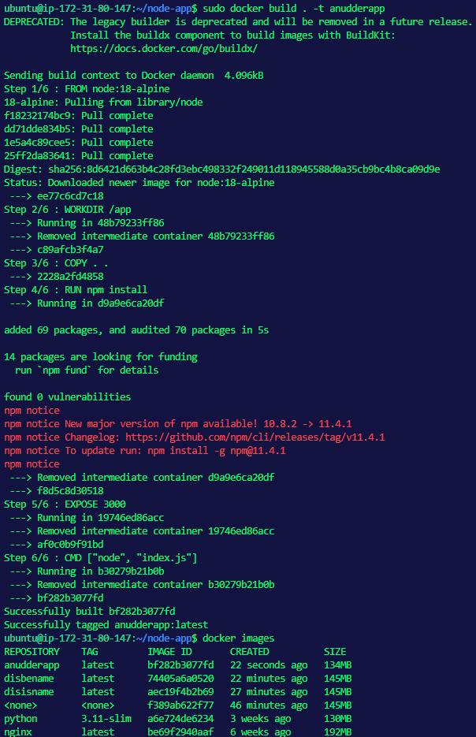

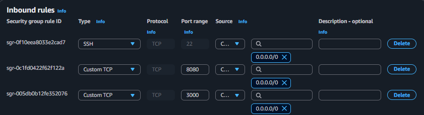

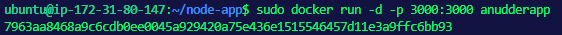

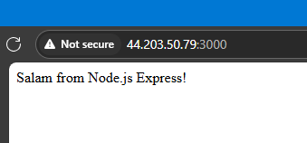

---
## 📁 Docker Compose

Used to manage multi-container applications using a `docker-compose.yml` file.

**Basic Example:**
```yaml
version: '3'
services:
  web:
    image: nginx
    ports:
      - "8080:80"
```

**Multi-Service Example:**
```yaml
version: '3'
services:
  web:
    image: nginx
    ports:
      - "8080:80"
  db:
    image: mysql
    environment:
      MYSQL_ROOT_PASSWORD: root123
```

**Commands:**
```bash
docker-compose up -d
docker-compose down
docker-compose logs
```
---

## 🔬 Practical Assignments

### 🐍 Flask App (Dockerized)

**app.py**
```python
from flask import Flask
app = Flask(__name__)
@app.route('/')
def home():
    return "Salam from Flask in Docker!"
app.run(host='0.0.0.0', port=8000)
```

**requirements.txt**
```
flask
```

**Dockerfile**
```Dockerfile
FROM python:3.11-slim
WORKDIR /app
COPY . .
RUN pip install --no-cache-dir -r requirements.txt
EXPOSE 8000
CMD ["python", "app.py"]
```

```bash
sudo docker build -t python_app .
sudo docker run -p 8000:8000 python_app
```

---

### 📦 Node.js App

**index.js**
```js
const express = require('express');
const app = express();
app.get('/', (req, res) => {
  res.send('Salam from Node.js Express!');
});
app.listen(3000, () => {
  console.log('Node app listening on port 3000');
});
```

**package.json**
```json
{
  "name": "node-app",
  "version": "1.0.0",
  "main": "index.js",
  "scripts": {
    "start": "node index.js"
  },
  "dependencies": {
    "express": "^4.17.1"
  }
}
```

**Dockerfile**
```Dockerfile
FROM node:18
WORKDIR /app
COPY . .
RUN npm install
EXPOSE 3000
CMD ["npm", "start"]
```

```bash
sudo docker build -t node_app .
sudo docker run -p 3000:3000 node_app
```

---

### 📄 Task 1

Create a basic `docker-compose.yml` file:
```yaml
version: '3'
services:
  web:
    image: nginx
    ports:
      - "8080:80"
```


### 📄 Task 2

Create a multi-container app:
```yaml
version: '3'
services:
  web:
    image: nginx
    ports:
      - "8080:80"
  db:
    image: mysql
    environment:
      MYSQL_ROOT_PASSWORD: root123
```

📌 _Output:_

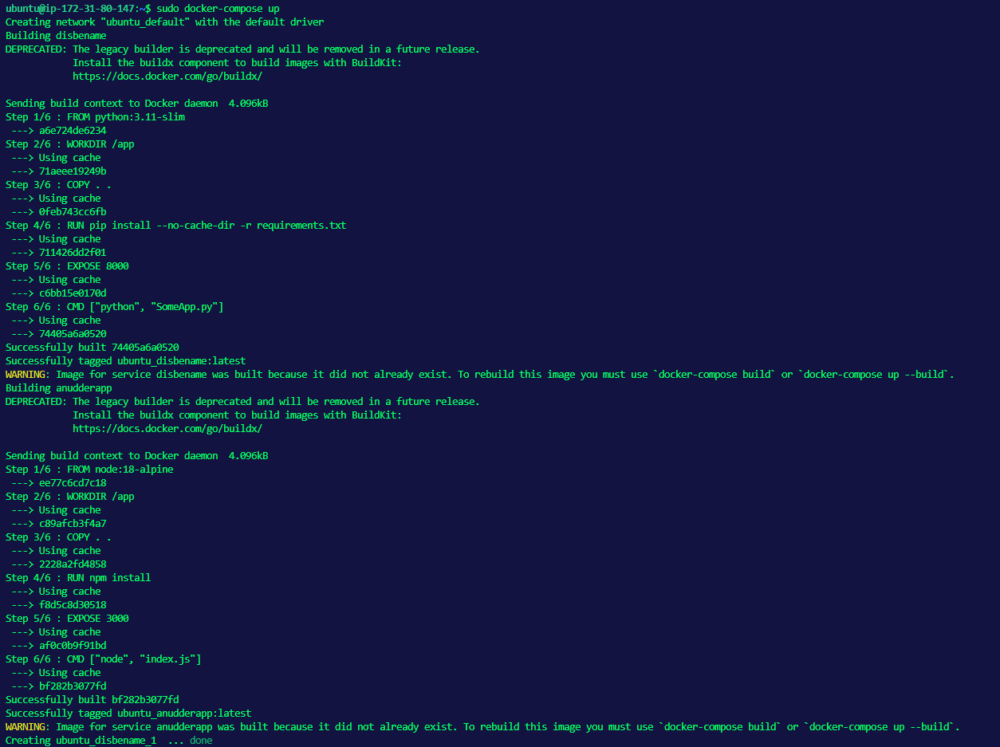

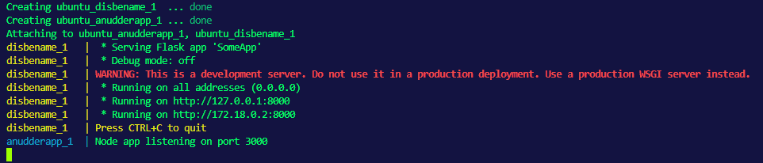

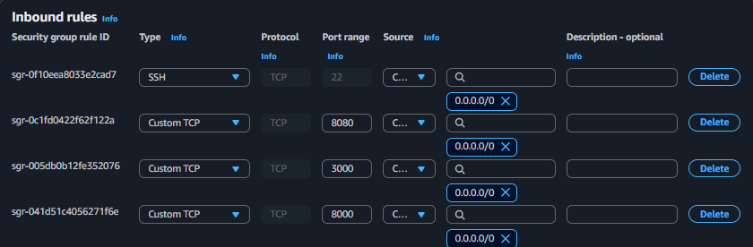

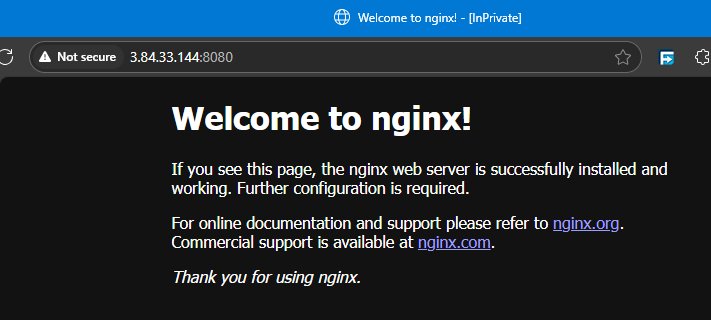

---

## 📚 References

- [Docker Docs](https://docs.docker.com/)
- [Dockerfile Reference](https://docs.docker.com/engine/reference/builder/)
- [Docker Compose Guide](https://docs.docker.com/compose/)
